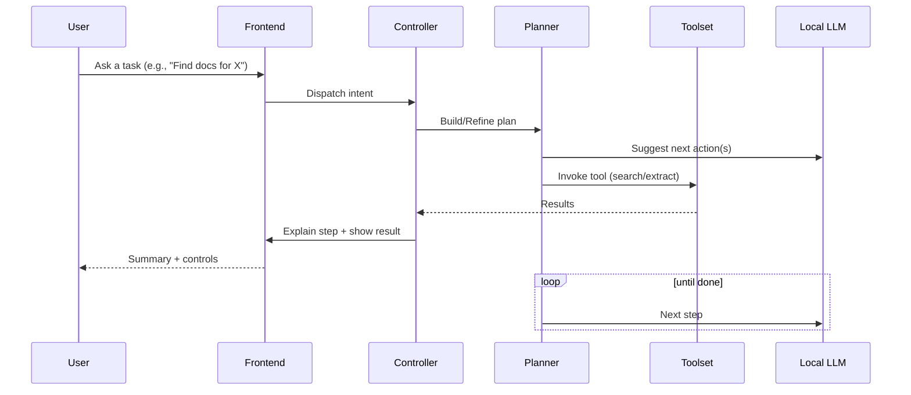

# Local AI Web Navigator — Future Prototype (NexusAI) 🚀🤖

[](#)
[](#)
[](#)
[](#)

A refined, UI‑first prototype of a privacy‑centric “Local AI Web Navigator.” This repo focuses on product UX, explainability, and rapid iteration in the browser. It ships a demoable front end with model selection, a simulated multi‑persona video call experience, and a clean path to integrate a local LLM + tools later. ✨

> Recruiter TL;DR: This is a polished, TypeScript/React prototype that demonstrates strong product thinking, UI craft, and a clear migration path from the Python/Playwright implementation to a modular, local‑first web agent.

---

# Local AI Web Navigator — Future Prototype Demo Photos 

<!-- HERO GALLERY: shows immediately when someone opens the README -->
<p align="center">
  
  
  
</p>
<p align="center">
  
  
  
</p>
<p align="center">
  
  
  
</p>

## What’s new here compared to the Python repo? 🔁

This repo: [Local-AI-Web-Navigator-Future-Prototype](https://github.com/AshmitThakur23/Local-AI-Web-Navigator-Future-Prototype)  
Reference repo: [Local-AI-Web-Navigator](https://github.com/AshmitThakur23/Local-AI-Web-Navigator)

- UI-first, TypeScript React app (Vite + Tailwind + shadcn‑ui) vs. Python/Flask backend with HTML/CSS/JS.
- Rich “Model Picker” UX with:
  - Local/Cloud/Downloadable model states, search, keyboard shortcuts, persisted defaults via localStorage.
  - Simulated download flow to communicate scale and modality choices.
- “AI Video Call” demo (frontend‑only) with:
  - 6 personas, TTS/STT via Web Speech API, recording simulation, summary/Ask‑AI, and local persistence.
- Clear demo mode philosophy:
  - Everything labeled as “Demo”; runs entirely client‑side, no backend dependency to explore flows.
- Modern DX and code quality:
  - ESLint config for TS/React, shadcn component mapping via components.json, Vite entry via index.html → /src/main.tsx.

In contrast, the Python repo delivers a production‑leaning backend agent:
- Flask API + Ollama (Mistral) + Playwright automation.
- Live web search and scraping (DuckDuckGo + BeautifulSoup) with priority scoring.
- Product scraper UI with table/gallery, batching, and CSV export.
- Windows one‑click launchers (.bat/.ps1).

Together, they show both sides: backend capability (Python) and a modern, scalable front‑end experience (this repo) that can later plug into the same local LLM + tools.

---

## Deep dive: files in this repo 🔍

These are the key files currently present and what they do.

- README.md (this document)
  - Project overview, demos, architecture, and roadmap.

- README-MODEL-PICKER.md
  - Details a UI‑only Model Picker:
    - ModelChip inside the search bar (status + tooltip).
    - Modal with Local / Downloadable / Cloud groupings, search/filter, pin-as-default, keyboard navigation.
    - All state persisted in localStorage:
      - `nexus_model_primary` (pinned/default model),
      - `nexus_model_downloaded` (downloaded models).
    - Mocked progress for downloads to visualize large‑model UX.
    - No backend calls yet, designed for easy swap‑in of Ollama or API later.

- README-VIDEO-CALL-DEMO.md
  - Frontend‑only, persona‑driven video call simulation:
    - Personas: Health Coach, Dietitian, Skincare Expert, Education Tutor, Therapy Assistant, Hustle Coach.
    - Voice: Web Speech API for TTS; STT when available (Chrome/Edge), with graceful text‑input fallback.
    - Call recording simulation + local summaries and Ask‑AI across the transcript.
    - All labeled “Demo Mode”; no server or LLM required.
    - Components sketched: `VideoCallButton`, `CreateCallModal`, `VideoCallScreen`, `RecordingList`, `MeetingSummary`, `personas.ts`.

- index.html
  - Vite entry page. Loads `/src/main.tsx`, sets OpenGraph/Twitter metadata, favicon, and app root.
  - Clear brand surface for shareability and SEO preview.

- eslint.config.js
  - Modern ESLint config with:
    - `@eslint/js`, `typescript-eslint`, `eslint-plugin-react-hooks`, `eslint-plugin-react-refresh`.
    - Targets TS/TSX files, enables React hooks rules, and tolerates constant exports for hot refresh.

- components.json
  - shadcn‑ui configuration:
    - Tailwind paths, base color (slate), CSS variables, and alias mapping (components, utils, ui, lib, hooks).
    - Ensures consistent design-system usage across the app.


- Other project metadata
  - The repo is TypeScript‑dominant (97.5%), with Tailwind/shadcn CSS (1.4%), and small “Other” files (1.1%).
  - Typical Vite projects include `/src` with React components, assets, and routing. `index.html` references `/src/main.tsx`.

---

## Side‑by‑side comparison with the Python repo 🧪

| Dimension | Future Prototype (this repo) | Local-AI-Web-Navigator (Python) |
|---|---|---|
| Primary Focus | UX/product prototype, front‑end only | End‑to‑end backend agent with scraping |
| Languages | TypeScript 97.5% | Python 43.8%, JS/HTML/CSS, Batch/PS |
| Runtime | Vite + React + Tailwind + shadcn | Flask API, Playwright, BeautifulSoup, Ollama |
| LLM | Simulated (UI only) | Real local LLM via Ollama (Mistral) |
| Web Automation | Not wired yet (designed for later) | Playwright + DDG search + scraping & scoring |
| Data Persistence | localStorage for demo state | Files (agent_state/*.json), API responses |
| Demos | Model Picker; AI Video Call (personas, TTS/STT, recordings, summaries) | Product Scraper (table/gallery/CSV), Q&A with scoring |
| Launch | npm install → npm run dev | One‑click .bat/.ps1 or manual Python setup |
| Target Users | Product reviewers, recruiters, UX iteration | Power users, developers needing live automation |

What’s truly new here:
- A polished, explainable UI for model selection, persona‑based interactions, and demoable voice features.
- Clear separation of concerns so the UI can plug into any local model/tool process later.
- A presentable prototype for non‑engineers to “feel” the final product, even before wiring a backend.

---

## Architecture vision (how this evolves) 🧭

The plan is to keep all UX/flow in this TypeScript app and inject capabilities over time by attaching local tools (search, click, form‑fill, scrape) and a local LLM backend (Ollama-compatible). The orchestration remains explicit and explainable.

```mermaid
flowchart LR
    U[User] -->|Prompt / Click| UI[React UI (Vite)]
    UI --> C[Controller / State]
    C --> P[Planner / Orchestrator]
    P --> M[(Local LLM)]
    P --> T[Tools: Search • Click • Extract • Summarize]
    T --> W[Web Page]
    T --> E[(Extractors)]
    P --> MM[(Memory)]
    M --> C
    T --> C
    E --> C
    MM --> P
    C --> UI
```

Interaction loop:



---

## UI Gallery 📸

> All images are from the current demo mode. Click to open full size.

| Demo Sequence |
|---|
|  |
|  |
|  |
|  |
|  |
|  |
|  |
|  |
|  |

Focused demos:
- Model Picker → [README-MODEL-PICKER.md](README-MODEL-PICKER.md)
- Video Call (personas, TTS/STT, recordings) → [README-VIDEO-CALL-DEMO.md](README-VIDEO-CALL-DEMO.md)

---

## How to run locally 🏁

This project is a Vite + React + TypeScript app with Tailwind/shadcn. The current demo also references Firebase Authentication for the `/auth` flow.

1) Configure environment
- Copy `.env.example` to `.env.local` and fill in your Firebase values.
- Enable Google and Email/Password authentication in Firebase.

2) Install and run
```bash
npm install
npm run dev
```

3) Test authentication (demo)
- Visit `/auth`
- Click “Continue with Google”
- On success, you’ll be redirected to `/`

Security note:
- Do not commit `.env.local`.
- Firebase API key can be public for client usage, but secure the rest with Firebase rules.

---

## Project structure (current snapshot) 🗂️

```
/ (root)
├─ README.md                      # This file
├─ README-MODEL-PICKER.md         # UI-only model picker demo
├─ README-VIDEO-CALL-DEMO.md      # Frontend video-call demo
├─ index.html                     # Vite entry → loads /src/main.tsx
├─ eslint.config.js               # TS/React ESLint rules
├─ components.json                # shadcn + Tailwind config and aliases
├─ bun.lockb                      # (present if using Bun tooling)
├─ .gitignore
└─ Screenshot *.png               # Demo gallery assets used above
```

> Note: `index.html` references `/src/main.tsx`, which is the Vite/React entrypoint (co-located with app components).

---

## Roadmap 🗺️

Near term
- Wire Model Picker to a local LLM runtime (Ollama-compatible endpoint).
- Add pluggable “tools” (search, click, extract, summarize) with transparent logs.
- Bring the Product Scraper UX (from Python repo) into this UI with better visual explainability.

Mid term
- Memory layers (short‑term scratchpad + long‑term vector store).
- Multi‑modal inputs (screen understanding, voice I/O), task recipes (“research topic”, “compare prices”).
- Session export/share and replayable traces.

Long term
- Full local‑first agent loop with safety rails, permission prompts, and granular step control.

---

## Why this design? 💡

- Privacy and control: keep compute on device, reveal every step.
- Velocity: demo features without backend blockers; swap in real LLM/tools later.
- Clarity: personas, model states, and simulated flows help non‑engineers “feel” the product early.

---

## Contributing 🤝

Ideas, critiques, and PRs welcome—especially:
- Tool adapters (search, click, extract, summarize).
- LLM integration (Ollama, LM Studio, or OpenAI‑compatible).
- UI overlays for explainability (step traces, diffs, highlights).
- Bringing Python scraper features into this UI.

---

## License 📄

License to be finalized. Assume standard evaluation rights for reviewing the prototype.

---

Made with care by AshmitThakur23. ✨
