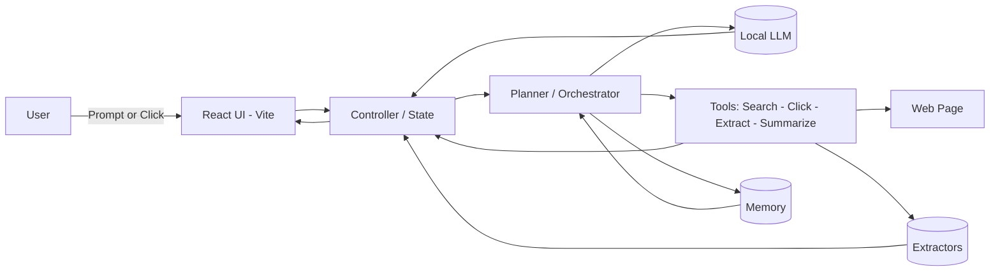
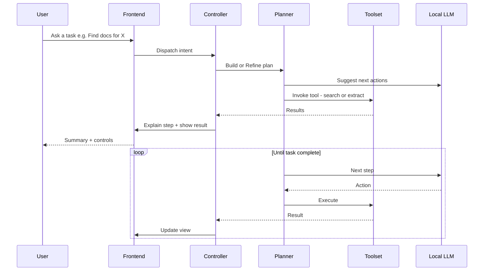
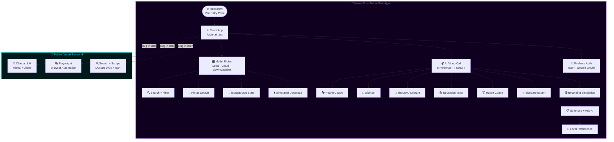
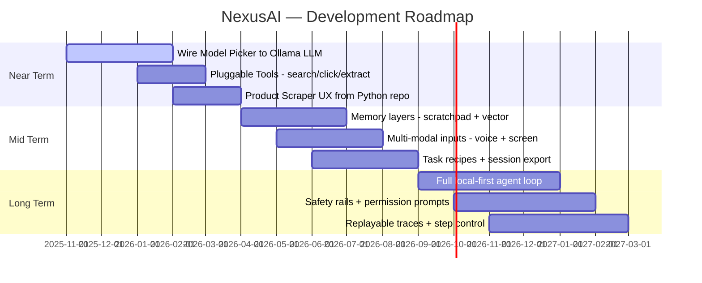

<div align="center">


<br/>

<table border="0" cellspacing="0" cellpadding="4">
<tr>
  <td align="center">
    
  </td>
  <td align="center">
    
  </td>
  <td align="center">
    
  </td>
  <td align="center">
    
  </td>
</tr>
<tr>
  <td align="center">
    
  </td>
  <td align="center">
    
  </td>
  <td align="center">
    
  </td>
  <td align="center">
    
  </td>
</tr>
</table>

<br/>

> **🚀 A refined, UI-first prototype of a privacy-centric Local AI Web Navigator.**
> Model selection · Multi-persona video calls · TTS/STT · Local-first · No backend required to demo.

<br/>

[](#architecture-vision-how-this-evolves-)
[](#ui-gallery-)
[](#how-to-run-locally-)
[](#roadmap-️)
[](#side-by-side-comparison-with-the-python-repo-)

</div>

> **Recruiter TL;DR:** This is a polished TypeScript/React prototype demonstrating strong product thinking, UI craft, and a clear migration path from the Python/Playwright implementation to a modular, local-first web agent.

---

## 🖼️ Demo Preview

<p align="center">
  
  
  
</p>
<p align="center">
  
  
  
</p>
<p align="center">
  
  
  
</p>

---

## 🔁 What's new vs. the Python repo?

| Dimension | 🚀 Future Prototype (this repo) | 🐍 Local-AI-Web-Navigator (Python) |
|---|---|---|
| Primary Focus | UX/product prototype, front-end only | End-to-end backend agent with scraping |
| Languages | TypeScript 97.5% | Python 43.8%, JS/HTML/CSS, Batch/PS |
| Runtime | Vite + React + Tailwind + shadcn | Flask API, Playwright, BeautifulSoup, Ollama |
| LLM | Simulated (UI only) | Real local LLM via Ollama (Mistral) |
| Web Automation | Not wired yet (designed for later) | Playwright + DDG search + scraping & scoring |
| Data Persistence | localStorage for demo state | Files (agent_state/*.json), API responses |
| Demos | Model Picker · AI Video Call (personas, TTS/STT) | Product Scraper (table/gallery/CSV), Q&A scoring |
| Launch | `npm install` → `npm run dev` | One-click `.bat/.ps1` or manual Python setup |
| Target Users | Product reviewers, recruiters, UX iteration | Power users, developers needing live automation |

- **Model Picker UX** — Local/Cloud/Downloadable states, search, keyboard shortcuts, persisted defaults via `localStorage`
- **AI Video Call demo** — 6 personas, TTS/STT via Web Speech API, recording simulation, summary/Ask-AI, local persistence
- **Demo mode philosophy** — everything labeled "Demo"; runs entirely client-side, zero backend dependency
- **Modern DX** — ESLint TS/React config, shadcn component mapping via `components.json`, Vite entry via `index.html → /src/main.tsx`

---

## 🔍 Deep Dive: Key Files

| File | Purpose |
|------|---------|
| `README.md` | Project overview, demos, architecture, roadmap |
| `README-MODEL-PICKER.md` | UI-only Model Picker — ModelChip, modal groupings, localStorage state |
| `README-VIDEO-CALL-DEMO.md` | Persona video call — TTS/STT, recordings, summaries, Ask-AI |
| `index.html` | Vite entry — loads `/src/main.tsx`, OpenGraph metadata, favicon |
| `eslint.config.js` | TS/React ESLint with hooks rules and hot-refresh support |
| `components.json` | shadcn-ui config — Tailwind paths, base color, alias mapping |

---

## 🧭 Architecture Vision (how this evolves)


```mermaid
flowchart LR
    U[User] -->|Prompt or Click| UI[React UI - Vite]
    UI --> C[Controller / State]
    C --> P[Planner / Orchestrator]
    P --> M[(Local LLM)]
    P --> T[Tools: Search - Click - Extract - Summarize]
    T --> W[Web Page]
    T --> E[(Extractors)]
    P --> MM[(Memory)]
    M --> C
    T --> C
    E --> C
    MM --> P
    C --> UI
```

---

## 🔄 Interaction Loop


```mermaid
sequenceDiagram
    participant U as User
    participant UI as Frontend
    participant C as Controller
    participant P as Planner
    participant T as Toolset
    participant M as Local LLM

    U->>UI: Ask a task e.g. Find docs for X
    UI->>C: Dispatch intent
    C->>P: Build or Refine plan
    P->>M: Suggest next actions
    P->>T: Invoke tool - search or extract
    T-->>C: Results
    C->>UI: Explain step + show result
    UI-->>U: Summary + controls
    loop Until task complete
        P->>M: Next step
        M-->>P: Action
        P->>T: Execute
        T-->>C: Result
        C->>UI: Update view
    end
```

---

## 📊 Module Breakdown


```mermaid
graph TB
    subgraph PROTO["🚀 NexusAI — Future Prototype"]
        A([🌐 index.html\nVite Entry Point]) --> B[⚛️ React App\n/src/main.tsx]

        B --> MP[🎛️ Model Picker\nLocal · Cloud · Downloadable]
        B --> VC[📹 AI Video Call\n6 Personas · TTS/STT]
        B --> AU[🔐 Firebase Auth\n/auth · Google OAuth]

        MP --> MP1[🔍 Search + Filter]
        MP --> MP2[📌 Pin as Default]
        MP --> MP3[💾 localStorage State]
        MP --> MP4[⬇️ Simulated Download]

        VC --> VC1[🎭 Health Coach]
        VC --> VC2[🥗 Dietitian]
        VC --> VC3[💆 Therapy Assistant]
        VC --> VC4[📚 Education Tutor]
        VC --> VC5[🏋️ Hustle Coach]
        VC --> VC6[✨ Skincare Expert]

        VC --> REC[🎬 Recording Simulation]
        REC --> SUM[📋 Summary + Ask-AI]
        SUM --> PERS[💾 Local Persistence]
    end

    subgraph FUTURE["🔮 Future: Wired Backend"]
        OL[🤖 Ollama LLM\nMistral / Llama]
        PL[🎭 Playwright\nBrowser Automation]
        SR[🔍 Search + Scrape\nDuckDuckGo + BS4]
    end

    B -.->|plug in later| OL
    B -.->|plug in later| PL
    B -.->|plug in later| SR

    style PROTO fill:#0f0020,stroke:#a855f7,color:#a855f7
    style FUTURE fill:#001a1a,stroke:#00f5ff,color:#00f5ff
```

---

## 📸 UI Gallery

> All screenshots are from current demo mode. Click to open full size.

| Demo Sequence | |
|---|---|
|  |  |
|  |  |
|  |  |
|  |  |
|  | |

Focused demos:
- **Model Picker** → [README-MODEL-PICKER.md](README-MODEL-PICKER.md)
- **Video Call** (personas, TTS/STT, recordings) → [README-VIDEO-CALL-DEMO.md](README-VIDEO-CALL-DEMO.md)

---

## 🏁 How to Run Locally

> Current demo references Firebase Authentication for the `/auth` flow.

**1. Configure environment**

```bash
cp .env.example .env.local
# Fill in your Firebase values
# Enable Google + Email/Password auth in Firebase console
```

**2. Install and run**

```bash
npm install
npm run dev
```

**3. Test authentication (demo)**
- Visit `/auth`
- Click **Continue with Google**
- On success → redirected to `/`

> ⚠️ Do **not** commit `.env.local`. Firebase API key can be public for client usage — secure the rest with Firebase rules.

---

## 🗂️ Project Structure

```
/ (root)
├── README.md                      # This file
├── README-MODEL-PICKER.md         # UI-only model picker demo
├── README-VIDEO-CALL-DEMO.md      # Frontend video-call demo
├── index.html                     # Vite entry → loads /src/main.tsx
├── eslint.config.js               # TS/React ESLint rules
├── components.json                # shadcn + Tailwind config and aliases
├── bun.lockb                      # (present if using Bun tooling)
├── .gitignore
└── Screenshot *.png               # Demo gallery assets
```

---

## 🗺️ Roadmap


```mermaid
gantt
    title NexusAI — Development Roadmap
    dateFormat YYYY-MM
    section Near Term
    Wire Model Picker to Ollama LLM     :active, r1, 2025-11, 2026-02
    Pluggable Tools - search/click/extract :      r2, 2026-01, 2026-03
    Product Scraper UX from Python repo  :      r3, 2026-02, 2026-04
    section Mid Term
    Memory layers - scratchpad + vector  :      r4, 2026-04, 2026-07
    Multi-modal inputs - voice + screen  :      r5, 2026-05, 2026-08
    Task recipes + session export        :      r6, 2026-06, 2026-09
    section Long Term
    Full local-first agent loop          :      r7, 2026-09, 2027-01
    Safety rails + permission prompts    :      r8, 2026-10, 2027-02
    Replayable traces + step control     :      r9, 2026-11, 2027-03
```

---

## 💡 Why This Design?

| Principle | Approach |
|-----------|----------|
| 🔒 **Privacy & Control** | Keep compute on device, reveal every step |
| ⚡ **Velocity** | Demo features without backend blockers; swap in real LLM/tools later |
| 🎯 **Clarity** | Personas, model states, and simulated flows help non-engineers feel the product early |

---

## 🤝 Contributing

Ideas, critiques, and PRs welcome — especially:

- 🔧 **Tool adapters** — search, click, extract, summarize
- 🤖 **LLM integration** — Ollama, LM Studio, or OpenAI-compatible
- 🔍 **UI overlays** — step traces, diffs, highlights for explainability
- 📦 **Python scraper features** — bring into this UI

---

## 📄 License

License to be finalized. Assume standard evaluation rights for reviewing the prototype.

---

<div align="center">


**Made with ✨ by [AshmitThakur23](https://github.com/AshmitThakur23)**

⭐ Star this repo · 🤝 Contribute · 🚀 Build the future

</div>
